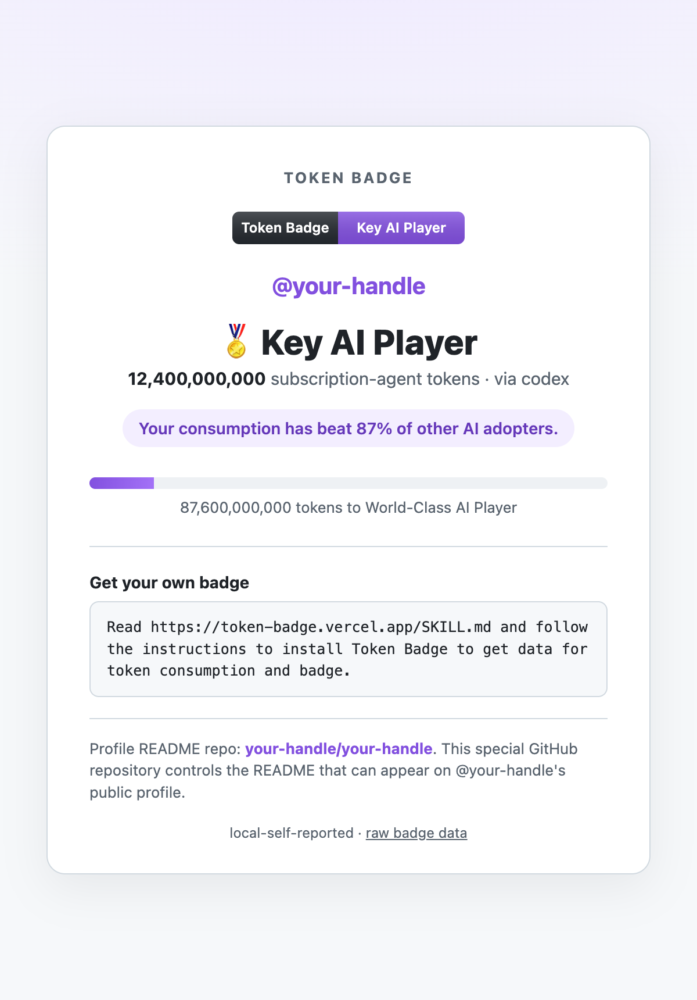

# Token Badge

Token Badge grants public profile badges for AI agent token usage. The first provider
target is Codex, using `ccusage codex monthly --json` as the local usage source.

## What It Looks Like

Each profile gets a shareable badge page at `https://token-badge.vercel.app/u/<login>`
showing the earned tier, total consumption, and where it ranks against other AI adopters:

<p align="center">
  
</p>

The badge itself is a live SVG you can drop into any profile, README, or site — it shows
the highest tier the profile has earned:

| Badge | Tier |
| --- | --- |
|  | 100M+ tokens |
|  | 1B+ tokens |
|  | 10B+ tokens |
|  | 100B+ tokens |

## Origin Story

The idea started when I saw the enterprise version of Codex support codex-insight, so
employees could check their token usage. That made me wonder what the same idea could
look like for the wider consumer audience. Then I found `ccusage`, checked my own
consumption, and immediately wanted to turn those totals into fun public tiers and
badges.

On Children's Day 2026, with PSG having lifted the UEFA Champions League trophy the
night before and the 2026 World Cup around the corner, this became a small
soccer-memory salute too. I wanted to nod to my old-kid memories of CM4 / 03-04,
where players were described by tiers and promise. That is where Hot AI Prospect,
Wonder AI Kid, Key AI Player, and World-Class AI Player come from.

## Start From Your AI Agent

Token Badge is a deployed service. Users do not run anything by hand — they give their
coding agent (Claude Code or Codex) one statement:

> **"Read https://token-badge.vercel.app/SKILL.md and follow the instructions to
> install Token Badge to get data for token consumption and badge."**

The service serves agent-followable instructions at `GET /SKILL.md`. The agent reads
them, detects whether it is running from Codex or Claude Code, routes to the matching
`ccusage` command, uploads the usage, reports the badge tier and percentile, and — only
with the user's consent — adds the badge to their GitHub profile. The canonical copy
lives in [SKILL.md](SKILL.md).

## First Scope

- Count AI coding-agent token consumption.
- Start with Codex usage collected by `ccusage`.
- Support Claude Code through the same local `ccusage` collection path.
- Bind usage to a GitHub identity before granting a badge.
- Keep provider-specific identity and usage evidence separate so the project can add
  Claude Code, Copilot, Gemini, and other agents later.

## Badge Tiers

| Threshold | Badge |
| ---: | --- |
| 100,000,000 tokens | Hot AI Prospect |
| 1,000,000,000 tokens | Wonder AI Kid |
| 10,000,000,000 tokens | Key AI Player |
| 100,000,000,000 tokens | World-Class AI Player |

Tier names salute the old soccer-management games (Championship Manager / Football
Manager) player-role ladder. The important invariant is that a public grant is based on
the highest accepted provider total for the linked GitHub profile.

## Consumption Percentile

Every upload is ranked against all other adopters who have uploaded, so a user sees
where their consumption lands in the community:

- While the project is still in its first 100 uploads, early adopters get a celebratory
  line instead of a noisy percentile:

  ```text
  Total consumption for badge/ranking: 150,000,000 tokens
  Badge tier: Hot AI Prospect
  You're one of the first 100 AI adopters to upload — yay! Check back later for your percentile.
  ```

- Once more than 100 profiles have uploaded, the line becomes a percentile against
  everyone else:

  ```text
  Total consumption for badge/ranking: 12,400,000,000 tokens
  Badge tier: Key AI Player
  Your consumption has beat 87% of other AI adopters.
  ```

The percentile counts the share of *other* adopters whose highest accepted total is
below yours. It is served from `GET /v1/rankings/<github-login>` and surfaced by the
agent in the [Quickstart](#quickstart) flow below.

## Quickstart

There is nothing to install from the service. A user gives their coding agent the
one-statement prompt in [Start From Your AI Agent](#start-from-your-ai-agent), and the
agent — following [SKILL.md](SKILL.md) — does everything locally with `ccusage` and
`curl`. No package download, no `uvx`, no clone; the agent already has `ccusage`,
`curl`, and `gh`:

```bash
# 1. read local usage (the agent picks codex or claude based on which agent it is)
TOTAL=$(ccusage <codex|claude> monthly --json | jq '.totals.totalTokens // ([.monthly[].totalTokens] | add)')

# 2. get a one-time challenge, then upload — the service computes the integrity hash
NONCE=$(curl -s -X POST https://token-badge.vercel.app/v1/challenges \
  -H 'content-type: application/json' \
  -d '{"collector_installation_id":"github:<node_id>","github_login":"<login>"}' | jq -r .challenge_nonce)

curl -s -X POST https://token-badge.vercel.app/v1/usage-snapshots \
  -H 'content-type: application/json' \
  -d '{"challenge_nonce":"'"$NONCE"'","collector_installation_id":"github:<node_id>","github_login":"<login>","provider":"<codex|claude>","usage_kind":"subscription","trust_level":"local-self-reported","source":"ccusage <provider> monthly --json","total_tokens":'"$TOTAL"'}'

# 3. see the result
curl -s https://token-badge.vercel.app/v1/rankings/<login>
```

The agent then reports the total consumption, earned tier, the percentile/early-adopter
line, and the public badge page `https://token-badge.vercel.app/u/<login>`. If the same
GitHub profile already uploaded another agent, the badge uses the highest accepted total
across all of them. Only with the user's consent does the agent add the badge to their
GitHub profile.

## MVP Flow

1. User signs in with GitHub. The service stores the GitHub `node_id`, not just the
   mutable login name.
2. Service issues a one-time collection challenge.
3. Local collector runs `ccusage codex monthly --json`, computes the total, attaches
   the challenge, and signs a usage snapshot with the user's collector key.
4. Service records the snapshot as Codex usage.
5. Service grants the highest matching badge from the user's highest provider total and
   reports the user's consumption percentile against all other adopters.

The first implementation is not provider-certified. It should label Codex `ccusage`
snapshots as `local-self-reported` until Codex exposes a server-side usage API or signed
export.

## Local Development

These commands are for developing the collector from this checkout. End users do not
need them — they use the agent-driven [SKILL.md](SKILL.md) flow above.

Install local development dependencies:

```bash
npm install -g ccusage
```

Current local collector dependencies are:

- Python 3.11 or newer.
- Node.js/npm for installing or upgrading `ccusage`.
- `ccusage` with Codex and Claude Code command support.

Check readiness before collecting usage:

```bash
PYTHONPATH=src python3 -m token_badge.cli doctor
```

Run the Codex collector directly from the checkout:

```bash
PYTHONPATH=src python3 -m token_badge.cli codex --github <github-login> --json
```

Run the Claude Code collector directly from the checkout:

```bash
PYTHONPATH=src python3 -m token_badge.cli claude --github <github-login> --json
```

Bind a Codex report to a server-issued collection challenge:

```bash
PYTHONPATH=src python3 -m token_badge.cli codex \
  --github <github-login> \
  --collector-id <collector-installation-id> \
  --challenge <server-nonce> \
  --json
```

To upload usage and immediately install or refresh the GitHub profile README badge,
add `--profile-badge`. The command uses the connected local GitHub account and defaults
the badge URL to `--upload-url` unless `TOKEN_BADGE_PUBLIC_URL` or `--badge-base-url` is
set:

```bash
PYTHONPATH=src python3 -m token_badge.cli codex \
  --github <github-login> \
  --collector-id <collector-installation-id> \
  --upload-url https://token-badge.example.com \
  --profile-badge
```

The same challenge-bound upload flow is available for Claude Code:

```bash
PYTHONPATH=src python3 -m token_badge.cli claude \
  --github <github-login> \
  --collector-id <collector-installation-id> \
  --challenge <server-nonce> \
  --json
```

List configured tiers:

```bash
PYTHONPATH=src python3 -m token_badge.cli tiers
```

Run tests:

```bash
PYTHONPATH=src python3 -m unittest
```

## Public Badge

The backend exposes a GitHub-profile-friendly SVG badge:

```markdown
[](https://token-badge.example.com/u/<github-login>)
Token Badge profile: [what this badge means](https://token-badge.example.com/u/<github-login>)
```

The GitHub profile README automation installs the badge image plus the landing-page
explanation link. The JSON endpoint at `/v1/badges/<github-login>` remains available for
raw badge data.

Install or refresh the badge block in the authenticated user's GitHub profile README:

```bash
TOKEN_BADGE_PUBLIC_URL=https://token-badge.example.com \
  PYTHONPATH=src python3 -m token_badge.cli profile-badge
```

Use `--dry-run` to preview the README content first. The command uses the existing local
GitHub connection through `gh`; if that connection is missing or lacks access, proceed
with GitHub SSO/OAuth before retrying.

After writing the README, the command performs a best-effort public profile visibility
check. If GitHub has not started showing the special README yet, open the printed
`https://github.com/<login>/<login>` URL and click `Share to Profile`.

## Repository Map

- `src/token_badge/`: small collector and tiering prototype.
- `docs/product-brief.md`: product framing and first user experience.
- `docs/data-model.md`: identity, usage, and badge grant model.
- `docs/badge-model.md`: tier rationale, profile association, and badge visuals.
- `docs/deployment.md`: TiDB-backed upload API setup and metadata boundary.
- `docs/trust-model.md`: anti-fooling model and its limits.
- `docs/roadmap.md`: build sequence from local prototype to badge service.
